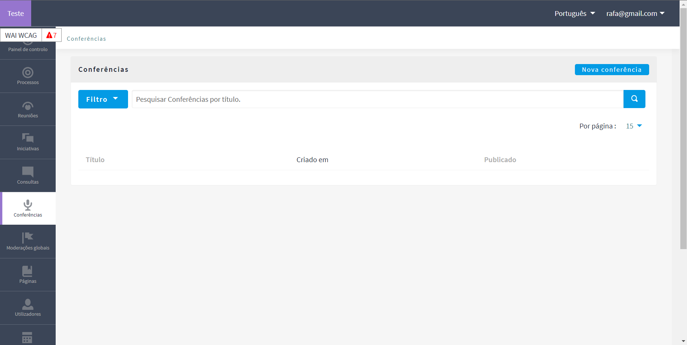
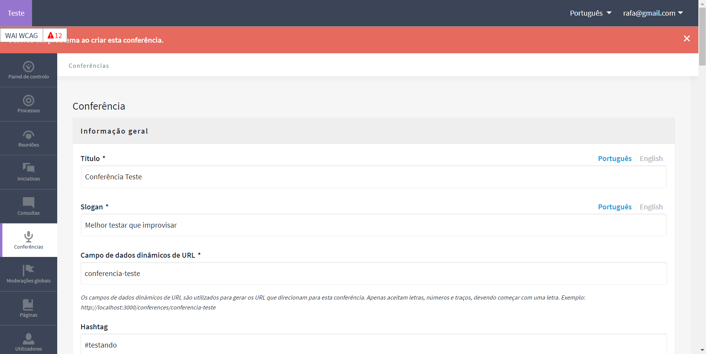

# Conferências 

## Introdução

&emsp;&emsp;O presente documento tem como objetivo mapear as funcionalidades existentes dentro do módulo "conferências", considerando uma perspectiva de administrador. Além de fornecer um tutorial rápido, demonstrando como utilizar as funcionalidades mapeadas e como as informações se apresentariam para o usuário.

## Entendendo a interface

&emsp;&emsp;Importante seguir um passo a passo para que o tutorial sirva a sua função de maneira didática. Para isso, vamos primeiro entender a interface do Decidim.

&emsp;&emsp;Representada na Imagem 1, está a tela da home quando o usuário acessa "http://localhost:3000/admin/conferences", ou seja, já dentro do módulo de "Conferências".

<b>Imagem 1:</b> Home do admin do Decidim dentro de Conferências. (Fonte: BOSI, Rafael. 2023)

&emsp;&emsp;Importante ressaltar que na imagem acima, não existia nenhuma conferência criada. Ao se criar conferências, elas são apresentada na forma de lista na mesma tela e, por padrão, são criadas "não publicada", ou seja, a princípio não irão aparecer na aplicação. A Imagem 2, exemplifica essa listagem de conferências.

<b>Imagem 2:</b> Conferências listadas. (Fonte: BOSI, Rafael. 2023)

&emsp;&emsp;Tudo bem, entendemos como é a interface inicial do módulo de conferências dentro do espaço admin do Decidim. Agora vamos passar para como criar uma conferência.

## Criando uma Conferência

&emsp;&emsp;Tanto na Imagem 1 quanto na 2, é possível identificar um botão em que esta escrito "Nova conferência" no canto direito superior da tela. Ao interagir com esse botão o sistema irá direcionar o usuário para a tela representada na Imagem 3.

<b>Imagem 3:</b> Tela de criação de uma conferência. (Fonte: BOSI, Rafael. 2023)

&emsp;&emsp;Importante lembrar que, diferentemente, do que esta sendo apresentado pelas Imagens 3 a X, os tópicos estão todos, inicialmente, em branco. 

### Tópicos 

- Título*
- Slogan*
- Campo de dados dinâmicos de URL*
- Hashtag
    - Realçado
- Breve descrição*
- Descrição*
- Objetivos
- Localização
- Imagem inicial
- Imagem da faixa
- [ ] Ativar âmbitos
    - Âmbito 
- [ ] Ativar Mostrar estatísticas
- Data de início* (Formato: dd/mm/yyyy)
- Data final* (Formato : dd/mm/yyyy)
- Ativar Registros (Erro de português )
    - Espaços disponíveis
    - Termo de Registro
- Processos participativos relacionados
- Reuniões relacionadas
- Consultas relacionadas

