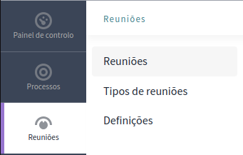

# Mapeamento de Reuniões

## Objetivo

## Tópicos

As opções disponiveis para a funcionalidade são:

- `Reuniões`
- `Tipos de reuniões`
- `Definições`

Como pode ser observado na Imagem 1.

<b>Imagem 1:</b> Opções disponiveis. (Fonte: ALVISSUS, Giovanni. 20 jun. 2023)

## Reuniões

Dentro desta opção, podemos criar novas reuniões, onde a dividimos em 7 subtópicos:

- `Informação geral`
- `Duração`
- `Imagens`
- `Filtros`
- `Metadados`
- `Visibilidade`
- `Outros`

### Informação Geral

#### 01. Título

#### 02. Subtítulo

#### 03. Posição de Ordenamento

#### 04. Campo de dados dinâmicos de URL

#### 05. Hashtag

#### 06. Pequena descrição

#### 07. Descrição

#### 08. Objetivo da ação

#### 09. Composição

#### 10. Organização interna

#### 11. Anunciamento

